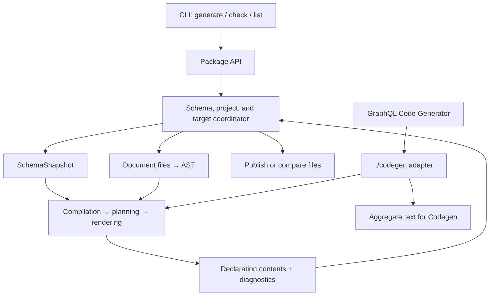

# Generator architecture

[Русский](../ru/ARCHITECTURE.md) | [All languages](../README.md)

## Purpose and output

`@omnicajs/graphql-precise-dts` transforms GraphQL schemas and operation documents
into TypeScript declarations. A document declaration describes variables, the
response shape, fragment types, and `TypedDocumentNode`. The generator also
produces schema types, enums, and an aggregate declaration file for selected
documents.

The generator does not execute requests against a GraphQL server. It derives
the response contract from the schema and the document's selection sets. For
example, `payload: user { label: name }` defines response properties named
`payload` and `label`; their value types come from the schema fields `user` and
`name`.

## Public boundaries

| Entrypoint | Contract | Implementation |
|---|---|---|
| Package root | `defineConfig`, `TsType` constructors, `generateDeclarations`, `checkDeclarations`, `listProjects`, and public types | `src/index.ts` |
| CLI | Commands, configuration file, stdout/stderr, and exit code | `src/cli.ts` → `src/cli/` |
| `@omnicajs/graphql-precise-dts/codegen` | GraphQL Code Generator plugin returning aggregate declarations | `src/integrations/codegen.ts` |

Build entrypoints are defined in [vite.config.ts](../../vite.config.ts). The
built package provides ESM and CJS. A separate worker runtime is included as an
execution resource, but it is not a user-facing API.

## Schemas, projects, and targets

Configuration contains a shared `root`, a `schemas` registry, and a `projects`
registry.

- A **schema** owns its SDL source, scalar, directive, and naming policies,
  type module names, and optional schema output files.
- A **project** defines a document root and a set of targets.
- A **target** selects documents, references exactly one schema, and defines a
  declaration tree with an optional aggregate file.

One schema can serve several projects and targets. A project can contain targets
for different schemas. Compilation is isolated by target: definitions from
different targets do not share a GraphQL name registry.

`typesModule` and `enumsModule` define references in declarations. Physical
creation of schema types is controlled separately by `schema.outputs`: a module
reference alone does not instruct the generator to create that module.

`resolve.alias` maps filesystem paths to TypeScript module IDs. It is separate
from GraphQL field aliases and the naming policy for type names.

## Components and responsibilities

All paths in this table are relative to `src/`.

| Component | Responsibility |
|---|---|
| `config/` | Public configuration types, the `TsType` DSL, and configuration validation |
| `generate.ts`, `check.ts`, `projects.ts` | API workflows: generation under locks, output comparison, and project listing |
| `plan.ts` | Iterating over schemas/projects/targets, invoking generation, and assigning output files |
| `filesystem/` | Reading sources, resolving imports and module IDs, cache, locks, ownership, file comparison, and writing |
| `schema/` | GraphQL schema facts, snapshots and access to them, rendering schema types and enums |
| `generation/compile.ts` and related modules | Validating AST against the schema and building `CompiledDocument` |
| `generation/plan/` | Validating relationships between definitions, normalizing selections, response variants, names, and imports |
| `generation/render*` | Converting a document plan into TypeScript and building aggregates |
| `generation/schedule.ts`, `bundle.ts`, `worker.ts` | Connecting document generation to execution machinery |
| `execution/` | A generic queue and bounded `worker_threads` pool, result ordering, and worker failures |
| `integrations/codegen*` | Adapting Codegen inputs to document generation and translating diagnostics into the Codegen contract |
| `cli/` | Parsing arguments, loading configuration, calling the API, and presenting results in the terminal |

There are two distinct plans: `plan.ts` builds the **output file plan for the
entire run**, while `generation/plan/` builds the **semantic plan for one
document**. The filesystem planner does not determine GraphQL response shapes;
the semantic planner does not select publication directories.

## Data models

### Schema

`GraphQLSchemaView` adapts `GraphQLSchema` into a source of facts for building
`SchemaSnapshot`. A snapshot is a serializable structure containing a format
version, an SDL fingerprint, root types, schema types, and directives.

The compiler reads the snapshot through `SnapshotSchemaView`, which implements
`SchemaView`. This interface provides type, field, operation root, and subtype
lookups. Types are connected by `TypeId`; nullability and lists are represented
by the recursive `SchemaTypeRef`: `named`, `list`, and `non-null`. The snapshot
contains neither `GraphQLSchema` methods nor prepared operation declarations.

### Compiled document

`CompiledDocument` contains operation and fragment definitions in source order.
The selection model distinguishes fields, `__typename`, named spreads, and
inline fragments. It retains:

- the original schema field separately from the response property name;
- the type, argument signature, and applied directive effects;
- whether a selection is included and whether it is conditional;
- diagnostic source locations and fragment provider identity;
- nested selections and `possibleTypes` for a `composite`: concrete objects or
  structural interface domains when no implementations are known.

With `typename: 'abstract'`, the compiler records client-backed implicit typename
selections for known abstract implementations. Their presence follows fragment
expansion and conditionality. The implicit marker prevents invented conflicts
with directive policies on explicit typename selections.

Variables carry their type, optionality, default information, and argument
usages. Recursive input objects use a finite structure with `input-reference`.
Scalar mappings distinguish input from output. Users define them with `TsType`,
but compiled scalar types are already represented as TypeScript strings.

### Document plan

`PlannedDocument` contains definitions, required imports, and selection sets
ready for output. `PlannedSelectionSet.variants` describes response variants
for concrete GraphQL types. Normalization decides which fields to merge, which
fragments to expand, and which to retain as references.

The renderer reads this plan without traversing the GraphQL AST again. It emits
nullable/list wrappers, optional properties, unions, fragment intersections,
variables, and `TypedDocumentNode`.

### Results and declaration trees

Document generation returns content with a module ID and diagnostics. The
coordinator adds schema/project/target identity, the physical output path, and
the output kind. `DeclarationTree` groups files for checking and publication;
a manifest records generator-owned paths and content hashes.

Tree outputs are external file modules with relative provider imports. Aggregate
and Codegen outputs use ambient module IDs. Both render the same planned document,
without recompiling operations or parsing generated text. Schema policies include
independent enum-member casing and optional client-backed abstract discriminators.
Interfaces without known implementations have structural selections and a string
typename; their interface IDs describe selection applicability, not runtime names.

## Identity and ownership

- A schema is resolved once per schema ID in a plan; an unused schema without
  its own outputs is not loaded.
- A physical document belongs to only one target in a run.
- A module ID must identify a document unambiguously within a target. A collision
  causes an error rather than automatic renaming.
- An external fragment is resolved through an explicit import of its provider
  document. A compiled fragment is identified by `sourcePath` and its name.
- An output file has one producer. Multiple targets may share a tree root when
  their output files do not collide.
- Publication does not overwrite unowned files or files modified after the
  generator wrote them. Only stale files from the previous manifest may be deleted.

## Execution and failure boundaries

Schemas, projects, and targets are processed sequentially. A target's documents
are first compiled in the main thread; planning and rendering individual
documents may run in workers. Job completion order does not change result order.
The cache stores schema snapshots, not document ASTs or operation outputs.

Expected document errors become structured diagnostics. Warnings allow successful
outputs to be published. Any diagnostic with severity `error` prevents publication
of all declarations in the run. Configuration, schema, filesystem, and unexpected
internal errors may reject the API call.

Publication preflights all trees, then atomically replaces each file individually
and writes manifests last. There is no transaction across all trees or rollback
on an I/O failure. Cache and project locks have their own lifecycle and may be
written before declaration publication.

See [FLOW.md](FLOW.md) for call order and the behavior of each execution mode.
