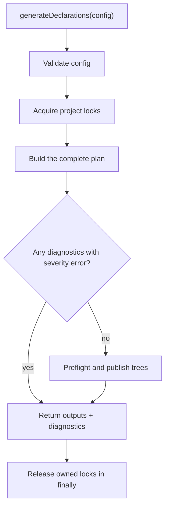
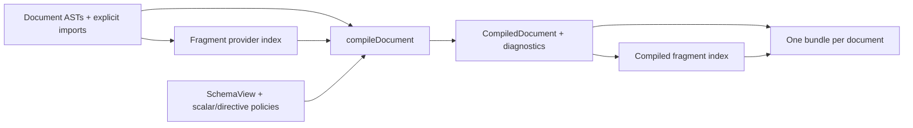

# Generation flow

[Русский](../ru/FLOW.md) | [All languages](../README.md)

This document traces a call from configuration and source files to operation
types and publication. See [ARCHITECTURE.md](ARCHITECTURE.md) for the purpose of
each model and component.

## 1. Entrypoint and locks

`generateDeclarations(config, options?)` validates configuration, then acquires project
locks in a stable order. Lock files live in `.graphql-precise-dts/locks/` relative
to `config.root` by default. `locks.directory` overrides this location: relative
paths resolve from `config.root`, while absolute paths are used directly.
Concurrent runs for the same project must use the same directory. A lock contains a PID and a unique token; an active lock rejects
a competing run, while a stale lock can be recovered. Cleanup in `finally`
removes only the current run's lock if its token has not been replaced.

Inside the locks, `createDeclarationPlan(config, { writeCache: true })` builds
the plan for the entire run. Only after that plan is complete does the API decide
whether to publish declarations. Returned `outputs` are generated results: when
`diagnostics` contains errors, they do not mean the corresponding files were
published.

Exceptions also pass through lock cleanup, but reject the call instead of
returning a result. Locks and cache are not part of the publication transaction.

## 2. Preparing a schema

The coordinator visits schema IDs in sorted order. A schema without its own
outputs and without a target referencing it is skipped.

For a used schema, the SDL is read and its fingerprint is computed. When caching
is enabled, the generator checks the JSON entry, format versions, generator and
GraphQL versions, schema ID, fingerprint, scalar/directive/naming configuration
hash, snapshot structure, and snapshot content hash.

A cache hit supplies the existing snapshot. If the entry is missing, corrupt,
or incompatible, the generator calls `buildSchema`, validates the schema, and
builds a snapshot through `GraphQLSchemaView`. In `generate` mode, a new snapshot
is written to the cache if caching is enabled. The default cache directory is
`.graphql-precise-dts/cache/`; `cache.directory` overrides it, and
`cache.enabled: false` disables both cache reads and writes.

When `schema.outputs` is configured, the coordinator renders schema types and
enums and adds them to the file plan. Declarations have not been written to disk
at this point.

## 3. Selecting a target's documents

For each schema, the coordinator visits matching projects and targets in a
stable order. Each target has its own cycle:

1. Select files relative to `project.root` using an explicit list, a glob with
   exclusions, or a regexp. Deduplicate and sort the list.
2. Check that documents belong to the project root and to a single target.
3. Read source text, collect explicit document imports, and parse GraphQL ASTs.
4. Compute module IDs through `resolve.alias`, preferring the most specific path
   match. Reject ID collisions between different files.
5. Pass the documents and snapshot to the generator for one target.

Physical paths are used for ownership, import resolution, and diagnostics.
Module IDs are used for `declare module` and TypeScript imports; these identities
are not interchangeable.

A document syntax error produces a `skipped-document` warning. That document is
not compiled. If another document depends on one of its fragments, resolving
that dependency may produce an additional error. The warning alone does not
prevent other documents from being published.

## 4. Compiling ASTs into document models

`generation/generate.ts` builds an index of fragment definitions, creates a
`SnapshotSchemaView`, and calls `compileDocument` sequentially for every parsed
document.

For an operation, the compiler validates its name and resolves the root type
for query/mutation/subscription. Variable definitions become type references;
input types, default values, and name uniqueness are validated. Input compilation
accounts for nullability, defaults, recursive objects, and oneOf.

For each selection, the compiler:

- resolves directives and records `included`, `conditional`, non-null, and override
  effects;
- looks up the original schema field and validates arguments, literal values,
  and variable usages;
- stores the response property name as `alias ?? fieldName`, separately from the
  schema field;
- applies the mapping for the required direction to a scalar, retains an enum's
  type, and recursively compiles selections and determines concrete types for
  a composite;
- resolves a named spread to a local definition or an unambiguous provider among
  explicitly imported documents;
- retains source locations needed for diagnostics.

An unknown custom scalar or a missing mapping for the required direction causes
a document error. `CompilationError` becomes a diagnostic; unexpected exceptions
propagate. A failed document produces no partial declaration, and its fragments
are not added to the index of successfully compiled providers.

## 5. Planning the response shape

`generateBundle` receives the compilation result for one document and the target's
shared fragment index. For a successful compilation, it calls
`generation/plan/create.ts`.

The planner validates variable usages, including usages through referenced
fragments, subscription constraints, fragment cycles, and selection compatibility.
Then `planSelectionSet` constructs the response shape:

1. Decide whether concrete types need separate variants. Without type-specific
   selections, one variant may represent multiple types.
2. Select applicable inline fragments and spreads for each variant. Statically
   excluded selections are omitted; parent conditionality propagates to nested
   selections.
3. Expand conditional spreads, spreads requiring specialization, and overlapping
   nested composite fields that need to be merged.
4. Merge compatible repetitions by response property name, preserving types,
   conditionality, and nested shape. Incompatible fields or arguments cause an error.
5. Recursively build nested selection sets, plan imports, and check generated
   name collisions.

For example, `payload: user { userId: id }` preserves the schema's field types,
but the plan contains response names `payload` and `userId`. When a property is
selected both conditionally and unconditionally, merging must account for both
occurrences; the presence of a conditional directive alone does not make the
resulting property optional.

The output is a `PlannedDocument`: definitions, imports, and selection sets with
variants. The renderer must not resolve fragments or validate the AST again.

## 6. Rendering and executing bundles

`renderDocument` emits external modules for trees or `declare module` for
aggregates, imports, fragment types, variable and
payload types, and `TypedDocumentNode`. `SchemaTypeRef` controls nested lists
and `null`; conditionality controls a property's `?`. Composite variants become
unions, and retained fragment references become intersections.

A tree document with one operation gets a typed default export even with local
fragments. Fragment-only and multi-operation documents get a generic DocumentNode
default. Aggregate and Codegen retain their one-definition default-export rule.
A bundle result contains either declaration text and warnings or diagnostics
without an output file.

Bundles run sequentially by default. With `execution.mode: parallel` and an
available built worker runtime, planning and rendering are distributed across
reused `worker_threads`, up to `maxWorkers`. If the runtime cannot be found, a
queue in the main thread is used; that queue alone does not demonstrate CPU
parallelism.

**Initial AST compilation remains sequential.** Workers receive its results and
shared compiled-fragment and schema context. Results are stored by job index,
not completion order. A worker failure aborts execution and terminates the pool.
Parallel performance depends on planning cost, data transfer, and target size.

## 7. Assembling and publishing files

The coordinator maps module IDs back to source IDs, determines output paths,
adds project/target/schema identity to diagnostics, and assembles trees. When
an aggregate is enabled, it combines separately rendered ambient blocks into an
additional file. The tree keeps external modules and relative provider imports.

If any diagnostic in the plan has severity `error`, `generateDeclarations`
returns the result without publishing declarations. A prepared schema cache may
already exist at that point.

For an error-free plan, `publishDeclarationTrees` performs these steps:

1. Prepare every tree and read previous manifests.
2. Check the hashes of previously published files, unless `options.force` is
   `true`. Always check the absence of unowned files at planned paths. A conflict
   stops publication before the first write.
3. Write files using a temporary file and `rename`. If contents match, skip the
   write and preserve the timestamp.
4. Delete stale files owned by the previous publication, including modified ones
   when force is enabled.
5. Write manifests last.

The CLI exposes this invocation option as `generate --force`; `check` and `list`
reject it. Force does not bypass error diagnostics, manifest validation, or
ownership checks. It leaves the schema cache policy unchanged.

This provides a preflight check for the entire publication and atomic replacement
of individual files, not a single transaction. An I/O failure after writing has
begun may leave some files updated; there is no automatic tree-wide rollback.

## `checkDeclarations` and `listProjects`

`checkDeclarations` builds the same plan with `writeCache: false`, but compares
it against disk. It creates no project locks, cache entries, or output files.
If generation fails, differences remain empty: an incomplete plan is not used
to compare the published output.

| Difference | Meaning |
|---|---|
| `missing` | An expected file or manifest is absent |
| `changed` | Expected contents differ from published contents; also applies to manifests |
| `stale` | An unchanged file from the previous publication is no longer needed |
| `modified` | A generator-owned file has been modified since publication |
| `unowned` | A file exists at an expected path, but the generator does not own it |

`listProjects` validates configuration and returns sorted project IDs without
loading schemas or documents.

## CLI and Codegen

The CLI loads configuration and calls the corresponding API. Success returns
exit code `0`; errors return `1`. Differences also produce code `1` for `check`.
Warnings go to stderr but do not make a command fail on their own.

The `./codegen` adapter receives an existing `GraphQLSchema` and document ASTs,
validates its own settings, normalizes paths, collects imports and module IDs,
builds a snapshot, and calls document generation. Additional configuration fields
owned by Codegen are allowed.

The adapter prints warnings, rejects calls with diagnostics of severity `error`,
and returns aggregate text. It does not use project locks, persistent cache, or
tree publication. Codegen is responsible for writing the returned text.
