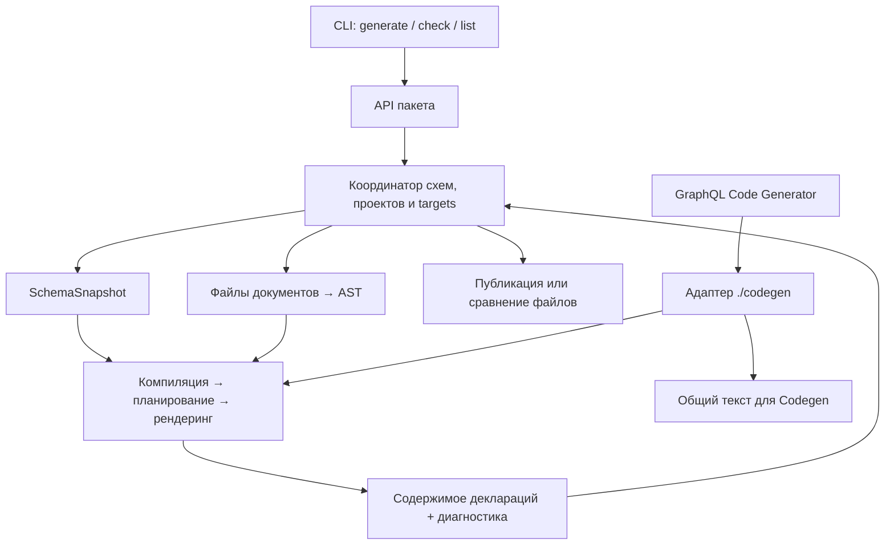

# Архитектура генератора

[English](../en/ARCHITECTURE.md) | [Все языки](../README.md)

## Назначение и результат

`@omnicajs/graphql-precise-dts` преобразует GraphQL-схемы и документы операций в
декларации TypeScript. Декларация документа описывает переменные, форму ответа,
типы фрагментов и `TypedDocumentNode`. Генератор также формирует типы схемы,
перечисления и общий файл деклараций выбранных документов.

Генератор не выполняет запросы к GraphQL-серверу. Он вычисляет контракт ответа
по схеме и selection sets документа. Например, `payload: user { label: name }`
задаёт свойства `payload` и `label`, а типы их значений определяются полями
`user` и `name` в схеме.

## Публичные границы

| Точка входа | Контракт | Реализация |
|---|---|---|
| Корень пакета | `defineConfig`, конструкторы `TsType`, `generateDeclarations`, `checkDeclarations`, `listProjects` и публичные типы | `src/index.ts` |
| CLI | Команды, конфигурационный файл, stdout/stderr, код завершения | `src/cli.ts` → `src/cli/` |
| `@omnicajs/graphql-precise-dts/codegen` | Plugin для GraphQL Code Generator, возвращающий общий текст деклараций | `src/integrations/codegen.ts` |

Точки сборки определены в [vite.config.ts](../../vite.config.ts). Собранный пакет
предоставляет ESM и CJS. Отдельный runtime worker входит в сборку как ресурс
исполнения, но не является пользовательским API.

## Схемы, проекты и targets

Конфигурация имеет общий `root`, реестр `schemas` и реестр `projects`.

- **Schema** владеет источником SDL, настройками scalars, directives и naming,
  именами модулей типов и необязательными выходными файлами схемы.
- **Project** задаёт корень документов и набор targets.
- **Target** выбирает документы, ссылается ровно на одну schema и задаёт дерево
  деклараций с необязательным aggregate-файлом.

Одна схема может обслуживать несколько проектов и targets. Один проект может
содержать targets для разных схем. Компиляция изолирована по target: определения
из разных targets не образуют общий реестр GraphQL-имён.

`typesModule` и `enumsModule` задают ссылки в декларациях. Физическое создание
типов схемы определяется отдельной настройкой `schema.outputs`: ссылка на модуль
сама по себе не поручает генератору создать этот модуль.

`resolve.alias` преобразует файловые пути в идентификаторы модулей TypeScript.
Он не связан с GraphQL aliases полей или политикой naming для имён типов.

## Компоненты и ответственность

Все пути в таблице относятся к `src/`.

| Компонент | Ответственность |
|---|---|
| `config/` | Публичные типы настроек, DSL `TsType`, проверка конфигурации |
| `generate.ts`, `check.ts`, `projects.ts` | Сценарии API: генерация под блокировками, сравнение результатов, список проектов |
| `plan.ts` | Обход schemas/projects/targets, вызовы генерации, привязка результатов к выходным файлам |
| `filesystem/` | Чтение исходников, разрешение импортов и module IDs, кеш, locks, ownership, сравнение и запись файлов |
| `schema/` | Факты GraphQL-схемы, snapshot и доступ к нему, рендеринг типов схемы и enums |
| `generation/compile.ts` и связанные модули | Проверка AST по схеме и построение `CompiledDocument` |
| `generation/plan/` | Проверки связей между определениями, нормализация selections, варианты результата, имена и импорты |
| `generation/render*` | Преобразование плана документа в TypeScript и сборка aggregate |
| `generation/schedule.ts`, `bundle.ts`, `worker.ts` | Связь генерации документа с механизмом исполнения |
| `execution/` | Универсальная очередь и ограниченный пул `worker_threads`, порядок результатов и ошибки workers |
| `integrations/codegen*` | Преобразование входов Codegen в вызов генератора документов и перевод диагностики в контракт Codegen |
| `cli/` | Разбор аргументов, загрузка конфигурации, вызов API и представление результата в терминале |

Здесь два разных плана: `plan.ts` собирает **план выходных файлов всего запуска**,
а `generation/plan/` строит **семантический план одного документа**. Файловый
планировщик не определяет форму GraphQL-ответа; семантический планировщик не
выбирает каталоги публикации.

## Модели данных

### Схема

`GraphQLSchemaView` адаптирует `GraphQLSchema` к источнику фактов для построения
`SchemaSnapshot`. Снимок — сериализуемая структура с версией формата,
отпечатком SDL, корневыми типами, типами схемы и директивами.

Компилятор читает снимок через `SnapshotSchemaView`, реализующий `SchemaView`.
Этот интерфейс предоставляет поиск типов, полей, корней операций и подтипов.
Типы связаны идентификаторами `TypeId`; nullable и списки выражены рекурсивным
`SchemaTypeRef`: `named`, `list`, `non-null`. Снимок не содержит методов
`GraphQLSchema` или подготовленных деклараций операций.

### Скомпилированный документ

`CompiledDocument` содержит определения операций и фрагментов в порядке
исходного документа. Selection-модель различает поле, `__typename`, named spread
и inline fragment. Она хранит:

- исходное поле схемы отдельно от имени свойства ответа;
- тип, сигнатуру аргументов и применённые эффекты директив;
- включённость и условность выбора;
- позиции для диагностики и идентичность поставщика фрагмента;
- вложенные selections и `possibleTypes` для `composite`: конкретные объекты
  или структурные области интерфейсов, когда реализации неизвестны.

При `typename: 'abstract'` компилятор добавляет неявную выборку typename для
известных реализаций абстрактного типа по гарантии клиента. Её присутствие
сохраняется при раскрытии фрагментов и учитывает условность. Маркер implicit
исключает искусственные конфликты с политиками директив на явных выборках typename.

Переменные имеют тип, optionality, сведения о default и usages в аргументах.
Рекурсивные input objects представлены конечной структурой с `input-reference`.
Scalar mapping разделяет input/output. Пользователь задаёт его через `TsType`,
но в скомпилированной модели тип scalar уже представлен строкой TypeScript.

### План документа

`PlannedDocument` содержит определения, необходимые импорты и готовые к выводу
selection sets. `PlannedSelectionSet.variants` описывает варианты ответа по
конкретным GraphQL-типам. Нормализация решает, какие поля объединить, какие
фрагменты раскрыть и какие сохранить как ссылки.

Рендерер читает этот план без повторного обхода GraphQL AST. Он выводит
nullable/list-оболочки, optional-поля, unions, intersections фрагментов,
переменные и `TypedDocumentNode`.

### Результат и дерево деклараций

Генерация документа возвращает содержимое с module ID и диагностику. Координатор
добавляет schema/project/target, физический путь и вид результата. `DeclarationTree`
группирует файлы для проверки и публикации; manifest хранит принадлежащие
генератору пути и хеши содержимого.

Дерево состоит из файловых модулей с относительными импортами поставщиков
фрагментов. Aggregate и Codegen используют ambient module IDs. Оба формата
рендерят один план документа без повторной компиляции операций и разбора готового
текста. Политики схемы задают отдельный casing членов enum и обязательность
неявного дискриминатора абстрактных выборок при гарантии клиента. Интерфейсы без
известных реализаций имеют структурные выборки и typename типа string; их IDs
описывают применимость выборок, а не имена runtime-типов.

## Идентичность и владение

- Схема разрешается один раз на её идентификатор в плане; неиспользуемая схема
  без собственных outputs не загружается.
- Один физический документ принадлежит только одному target в запуске.
- Module ID должен однозначно определять документ внутри target; конфликт
  вызывает ошибку, а не автоматическое переименование.
- Внешний фрагмент разрешается через явный импорт документа-поставщика.
  Идентичность скомпилированного фрагмента — пара `sourcePath` и имени.
- У выходного файла один производитель. Несколько targets могут использовать
  общий корень дерева, если их выходные файлы не конфликтуют.
- По умолчанию публикация отклоняет чужие файлы и файлы, изменённые после генерации.
  `generateDeclarations(config, { force: true })` перезаписывает запланированные
  выходные пути независимо от принадлежности и удаляет устаревшие файлы из manifest.
  Остальные файлы сохраняются и перечисляются в `result.warnings`; они не попадают
  в новый manifest. Удалять можно только устаревшие файлы из предыдущего manifest.

## Границы исполнения и отказов

Схемы, проекты и targets обходятся последовательно. Документы target сначала
компилируются в основном потоке; планирование и рендеринг отдельных документов
могут выполняться в workers. Порядок завершения jobs не меняет порядок результатов.
Кеш сохраняет snapshots схем, а не AST документов или результаты операций.

Ожидаемые ошибки документов становятся структурированной диагностикой.
Предупреждения допускают публикацию успешных результатов. Наличие диагностики
уровня `error` блокирует публикацию всех деклараций запуска. Ошибки конфигурации,
схемы, файловой системы и неожиданные внутренние исключения могут прервать вызов.

Публикация предварительно проверяет все деревья, затем атомарно заменяет каждый
файл по отдельности и записывает manifests последними. Общей транзакции на все
деревья и отката при сбое ввода-вывода нет. Кеш и project locks имеют собственный
жизненный цикл и могут записываться до публикации деклараций.

Последовательность вызовов и поведение каждого режима описаны в [FLOW.md](FLOW.md).
