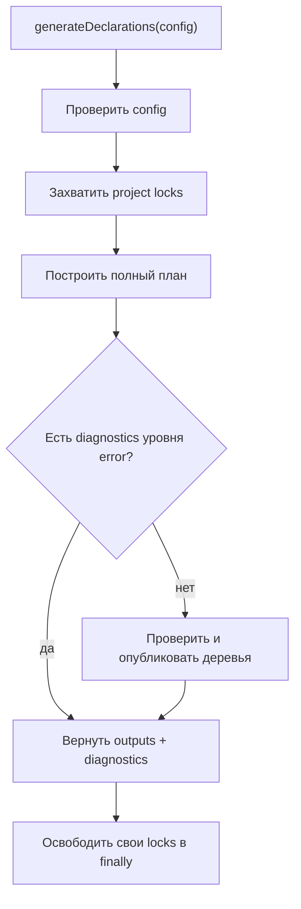
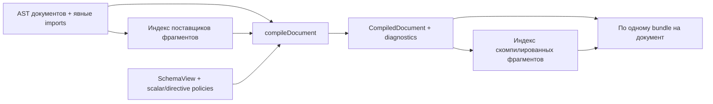

# Выполнение генерации

[English](../en/FLOW.md) | [Все языки](../README.md)

Этот документ прослеживает вызов от конфигурации и исходных файлов до типов
операций и публикации. Назначение моделей и компонентов описано в
[ARCHITECTURE.md](ARCHITECTURE.md).

## 1. Вход и блокировки

`generateDeclarations(config)` проверяет конфигурацию, затем захватывает
блокировки проектов в стабильном порядке. Файлы блокировок находятся в
`.graphql-precise-dts/locks/` относительно `config.root`. Блокировка содержит PID
и уникальный token; активная блокировка отклоняет конкурирующий запуск, а
устаревшую можно восстановить. Освобождение в `finally` удаляет только свою
блокировку, если её token не заменён.

Внутри блокировок `createDeclarationPlan(config, { writeCache: true })` строит
план всего запуска. Только после построения плана API решает, публиковать ли
декларации. Возвращаемые `outputs` — сформированные результаты: при ошибках в
`diagnostics` они не означают, что соответствующие файлы были опубликованы.

Исключение также проходит через освобождение блокировок, но вместо результата
отклоняет вызов. Блокировки и кеш не являются частью транзакции публикации.

## 2. Подготовка схемы

Координатор обходит идентификаторы схем в отсортированном порядке. Если у схемы
нет собственных outputs и на неё не ссылается target, схема пропускается.

Для используемой схемы читается SDL и вычисляется fingerprint. При включённом
кеше проверяются JSON-запись, версии форматов, версии генератора и GraphQL,
идентификатор схемы, fingerprint, хеш настроек scalars/directives/naming,
структура snapshot и хеш его содержимого.

При попадании используется готовый snapshot. При отсутствии, повреждении или
несовместимости записи генератор вызывает `buildSchema`, проверяет схему и
строит snapshot через `GraphQLSchemaView`. В режиме `generate` новый снимок
записывается в кеш, если кеш включён. По умолчанию каталог кеша —
`.graphql-precise-dts/cache/`; `cache.directory` позволяет его изменить,
`cache.enabled: false` отключает чтение и запись.

Если заданы `schema.outputs`, координатор рендерит типы схемы и enums и добавляет
их в план файлов. В этот момент декларации на диск ещё не записываются.

## 3. Выбор документов target

Для каждой схемы координатор обходит подходящие projects и targets в стабильном
порядке. Каждый target проходит отдельный цикл:

1. Выбор файлов относительно `project.root`: явный список, glob с исключениями
   или regexp. Список дедуплицируется и сортируется.
2. Проверка принадлежности документов корню проекта и одному target.
3. Чтение текста, сбор явных импортов документов и разбор GraphQL AST.
4. Вычисление module IDs через `resolve.alias`: выигрывает наиболее конкретное
   соответствие пути. Конфликт IDs разных файлов отклоняется.
5. Передача документов и snapshot в генератор одной цели.

Физический путь нужен для владения, разрешения импортов и диагностики. Module ID
нужен для `declare module` и TypeScript-импортов; эти идентификаторы не заменяют
друг друга.

Ошибка синтаксического разбора документа даёт предупреждение `skipped-document`.
Сам документ не компилируется. Если другой документ зависит от его фрагмента,
разрешение такой зависимости может дополнительно дать ошибку. Предупреждение
само по себе не блокирует публикацию остальных документов.

## 4. Компиляция AST в модель документа

`generation/generate.ts` строит индекс определений фрагментов, создаёт
`SnapshotSchemaView` и последовательно вызывает `compileDocument` для каждого
разобранного документа.

У операции проверяется имя и находится корневой тип query/mutation/subscription.
Определения переменных преобразуются в типовые ссылки; проверяются input types,
default values и уникальность имён. Сборка inputs учитывает nullable, defaults,
рекурсивные объекты и oneOf.

Для каждого selection компилятор:

- разрешает директивы и фиксирует `included`, `conditional`, non-null и override;
- ищет исходное поле в схеме и проверяет аргументы, literal values и usages
  переменных;
- сохраняет имя свойства ответа как `alias ?? fieldName` отдельно от поля схемы;
- для scalar применяет mapping нужного направления, для enum сохраняет тип,
  для composite рекурсивно компилирует selections и определяет concrete types;
- для named spread находит локальное определение либо однозначного поставщика
  среди явно импортированных документов;
- сохраняет позиции исходника, необходимые для диагностики.

Неизвестный custom scalar или отсутствующий mapping нужного направления даёт
ошибку документа. `CompilationError` преобразуется в диагностическое сообщение;
неожиданное исключение передаётся выше. Документ с ошибкой не создаёт частичную
декларацию, а его фрагменты не попадают в индекс успешно скомпилированных
поставщиков.

## 5. Планирование формы ответа

`generateBundle` получает результат компиляции одного документа и общий индекс
фрагментов target. Для успешной компиляции он вызывает `generation/plan/create.ts`.

Планировщик проверяет usages переменных, в том числе через используемые
фрагменты, ограничения subscriptions, циклы фрагментов и совместимость selections.
Затем `planSelectionSet` строит форму ответа:

1. Определяет, нужны ли отдельные варианты конкретных типов. При отсутствии
   type-specific selections один вариант может представлять несколько типов.
2. Для варианта отбирает применимые inline fragments и spreads. Статически
   исключённые selections не попадают в результат; условность родителей
   передаётся вложенным selections.
3. Раскрывает условные spreads, spreads, требующие специализации, и пересечения
   вложенных composite-полей, которые необходимо объединить.
4. Объединяет совместимые повторения по имени свойства ответа, сохраняя типы,
   условность и вложенную форму. Несовместимые поля или аргументы дают ошибку.
5. Рекурсивно строит вложенные selection sets, планирует импорты и проверяет
   конфликты генерируемых имён.

Например, `payload: user { userId: id }` сохраняет типы полей схемы, но план
содержит имена ответа `payload` и `userId`. Если одно свойство выбирается и
условно, и безусловно, объединение должно учитывать оба вхождения; один факт
наличия условной директивы не делает итоговое свойство optional.

На выходе получается `PlannedDocument`: definitions, imports и selection sets
с variants. Рендерер не должен заново разрешать фрагменты или проверять AST.

## 6. Рендеринг и исполнение bundles

`renderDocument` формирует файловый модуль для дерева или `declare module` для
aggregate, импорты, типы фрагментов, переменных
и payload, а также `TypedDocumentNode`. `SchemaTypeRef` определяет вложенность
списков и `null`; conditional определяет `?` у свойства. Composite variants
становятся union, сохранённые ссылки на фрагменты — intersections.

В дереве единственная операция получает typed default export вместе с локальными
фрагментами. Документ без операций или с несколькими операциями получает default
DocumentNode. Для aggregate и Codegen typed default требует ровно одно определение,
являющееся операцией.
Результат bundle содержит либо текст декларации и предупреждения, либо
диагностику без выходного файла.

По умолчанию bundles выполняются последовательно. При `execution.mode: parallel`
и наличии собранного worker runtime планирование и рендеринг распределяются
между переиспользуемыми `worker_threads`, максимум `maxWorkers`. Если runtime
не найден, используется очередь в основном потоке: такая очередь сама по себе
не доказывает параллельную работу CPU.

**Первичная компиляция AST остаётся последовательной.** Workers получают её
результаты и общий контекст скомпилированных фрагментов и схемы. Результаты
складываются по индексам jobs, а не в порядке завершения. Ошибка worker прерывает
исполнение и завершает пул. Скорость параллельного режима зависит от стоимости
планирования, передачи данных и размера target.

## 7. Сборка и публикация файлов

Координатор переводит module IDs обратно в идентификаторы исходников, определяет
выходные пути, добавляет project/target/schema к диагностике и собирает деревья.
При включённом aggregate он объединяет отдельно отрендеренные ambient-блоки
в дополнительный файл. Дерево сохраняет файловые модули и относительные импорты
поставщиков. Единственная операция получает typed default export даже при наличии
локальных фрагментов; документы без операций или с несколькими операциями —
default DocumentNode. Aggregate и Codegen сохраняют правило default export только
для единственного определения, являющегося операцией.

Если где-либо в плане есть диагностика уровня `error`, `generateDeclarations`
возвращает результат без публикации деклараций. Уже подготовленный кеш схемы
при этом может существовать.

Для плана без ошибок `publishDeclarationTrees` выполняет следующие действия:

1. Подготавливает все деревья и читает предыдущие manifests.
2. Проверяет хеши ранее опубликованных файлов и отсутствие чужих файлов на
   запланированных путях. Конфликт останавливает публикацию до первой записи.
3. Записывает файлы через временный файл и `rename`. Если содержимое совпадает,
   запись пропускается и timestamp сохраняется.
4. Удаляет устаревшие файлы, принадлежащие предыдущей публикации.
5. Записывает manifests последними.

Это предварительная проверка всей публикации и атомарная замена отдельных
файлов, а не общая транзакция. Сбой ввода-вывода после начала записи может оставить
часть файлов обновлённой; автоматического отката всего дерева нет.

## `checkDeclarations` и `listProjects`

`checkDeclarations` строит тот же план с `writeCache: false`, но сравнивает его
с диском. Он не создаёт project locks, кеш или выходные файлы. При ошибках
генерации список differences остаётся пустым: неполный план не используется для
сравнения публикации.

| Difference | Смысл |
|---|---|
| `missing` | Ожидаемый файл или manifest отсутствует |
| `changed` | Ожидаемое содержимое отличается от опубликованного; также применяется к manifest |
| `stale` | Неизменённый файл предыдущей публикации больше не нужен |
| `modified` | Принадлежащий генератору файл изменён после публикации |
| `unowned` | На ожидаемом пути есть файл, которым генератор не владеет |

`listProjects` проверяет конфигурацию и возвращает отсортированные project IDs,
не загружая схемы и документы.

## CLI и Codegen

CLI загружает конфигурацию и вызывает соответствующий API. Успех даёт код `0`,
ошибки — `1`. Для `check` различия также означают код `1`. Предупреждения выводятся
в stderr, но сами по себе не делают команду неуспешной.

Адаптер `./codegen` получает готовые `GraphQLSchema` и AST документов, проверяет
собственные настройки, нормализует пути, собирает imports и module IDs, строит
snapshot и вызывает генератор документов. Дополнительные поля конфигурации,
принадлежащие Codegen, допускаются.

Адаптер выводит предупреждения, отклоняет вызов при диагностике уровня `error`
и возвращает aggregate-текст. Он не использует project locks, постоянный кеш
или публикацию деревьев. За запись возвращённого текста отвечает Codegen.
